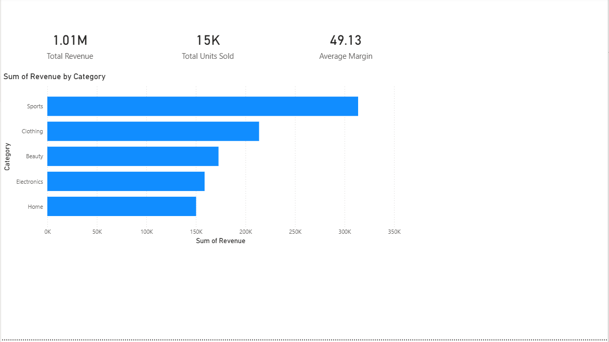
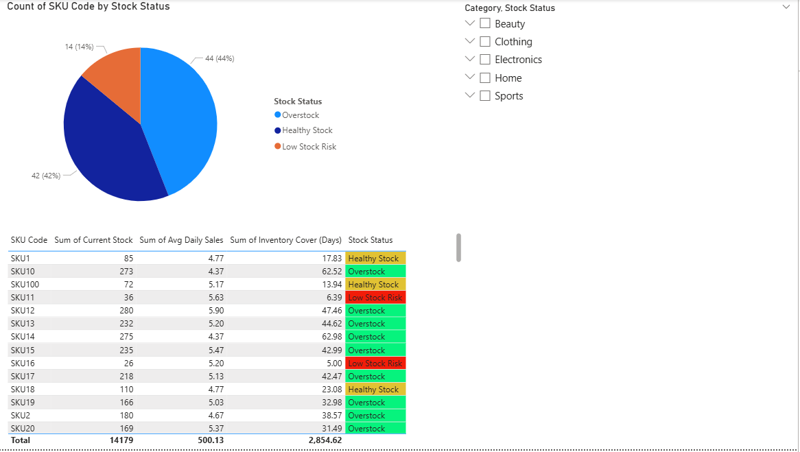

# Retail Sales & Inventory Analytics Dashboard

## Project Overview
This project analyzes retail sales and inventory performance using Python and Power BI.

The objective is to identify high-performing products, monitor inventory health,
and calculate key business metrics such as revenue, margin percentage, and
inventory cover.

## Tools Used
- Python (Pandas, NumPy)
- Data Cleaning and Transformation
- Power BI Dashboarding
- KPI Analysis

## Key Metrics
- Total Revenue
- Units Sold
- Average Daily Sales
- Inventory Cover (Days)
- Margin Percentage
- Stock Risk Classification

## Dashboard Insights
The dashboard provides insights into:

- Top selling products
- Category performance
- Low stock risk products
- Overstock situations
- Profit margin analysis

## Project Workflow

Data Generation → Data Cleaning → KPI Calculation → Dashboard Visualization

## Files Included

data/
    Raw datasets used for analysis

notebooks/
    Python notebook performing data cleaning and KPI calculations

dashboard/
    Power BI dashboard file

output/
    Final processed dataset used for visualization

## Dashboard Preview

### Executive Overview

### Inventory Risk

